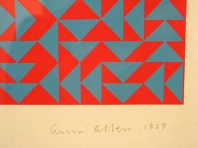

# 09.10.2023

- [09.10.2023](#09102023)
  - [Resources](#resources)
  - [Moiré excercise](#moiré-excercise)
    - [Solution](#solution)
  - [Loop excercise 2](#loop-excercise-2)
    - [Solution](#solution-1)
  - [Loop excercise 3](#loop-excercise-3)
    - [Solution](#solution-2)
  - [Annie Albers excercise](#annie-albers-excercise)
    - [Notes](#notes)
    - [Solution](#solution-3)


## Resources

## Moiré excercise

Create a script that generates a [Moiré effect](https://de.wikipedia.org/wiki/Moir%C3%A9).

### Solution

[p5js Moiré sketch](https://editor.p5js.org/stefanvoegelisrf/sketches/tZ5FHnudl)

## Loop excercise 2

Take the following code and improve it by using a loop:

```

function setup() {
  createCanvas(600, 600);
  
  noStroke();
}

function draw() {
  background(240);
 
  //Inititalwerte
  let a=3;
  let c=0;
  let steps=30;
  
  //Block1
  fill(0,c);
  ellipse(a,height/2,a,a);
 
  a+=a;
  c+=steps;
  
  //Block2
  fill(0,c);
  ellipse(a,height/2,a,a);
  
  a+=a;
  c+=steps;
  //Block3
  fill(0,c);
  ellipse(a,height/2,a,a);
  
  a+=a;
  c+=steps;
  //Block4
  fill(0,c);
  ellipse(a,height/2,a,a);
  
  a+=a;
  c+=steps;
  //Block5
  fill(0,c);
  ellipse(a,height/2,a,a);
  
  a+=a;
  c+=steps;
  //Block6
  fill(0,c);
  ellipse(a,height/2,a,a);
  
  a+=a;
  c+=steps;
  //Block7
  fill(0,c);
  ellipse(a,height/2,a,a);
  
  a+=a;
  c+=steps;
  //Block8
  fill(0,c);
  ellipse(a,height/2,a,a);
  
}

```

### Solution

[p5js loops excercise 2 sketch](https://editor.p5js.org/stefanvoegelisrf/sketches/YknbaTjn3)

## Loop excercise 3

Rewrite the following script and rewrite it using a loop.

```

let x, y, distance;

function setup() {
  createCanvas(300, 300);
  background(240);
  x = 0;
  y = 300;
}

function draw() {
  //background(220);
  line(0,0,300,300);
  line(0,20,300,300);
  line(0,40,300,300);
  line(0,60,300,300);
  line(0,80,300,300);
  line(0,100,300,300);
  line(0,120,300,300);
  line(0,140,300,300);
  line(0,160,300,300);
  line(0,180,300,300);
  line(0,200,300,300);
  line(0,220,300,300);
  line(0,240,300,300);
  line(0,260,300,300);
  line(0,280,300,300);
}

```

### Solution

[p5js loops excercise 3 sketch](https://editor.p5js.org/stefanvoegelisrf/sketches/Diu5oV6eI)

## Annie Albers excercise

Use the following script as inspiration and try to create something like the following image.

```

// P_2_1_1_01
//
// Generative Gestaltung – Creative Coding im Web
// ISBN: 978-3-87439-902-9, First Edition, Hermann Schmidt, Mainz, 2018
// Benedikt Groß, Hartmut Bohnacker, Julia Laub, Claudius Lazzeroni
// with contributions by Joey Lee and Niels Poldervaart
// Copyright 2018
//
// http://www.generative-gestaltung.de
//
// Licensed under the Apache License, Version 2.0 (the "License");
// you may not use this file except in compliance with the License.
// You may obtain a copy of the License at http://www.apache.org/licenses/LICENSE-2.0
// Unless required by applicable law or agreed to in writing, software
// distributed under the License is distributed on an "AS IS" BASIS,
// WITHOUT WARRANTIES OR CONDITIONS OF ANY KIND, either express or implied.
// See the License for the specific language governing permissions and
// limitations under the License.

/**
 * changing strokeweight and strokecaps on diagonals in a grid
 *
 * MOUSE
 * position x          : left diagonal strokeweight
 * position y          : right diagonal strokeweight
 * left click          : new random layout
 *
 * KEYS
 * 1                   : round strokecap
 * 2                   : square strokecap
 * 3                   : project strokecap
 * s                   : save png
 */
'use strict';

var tileCount = 20;
var actRandomSeed = 0;

var actStrokeCap;

function setup() {
  createCanvas(600, 600);

  actStrokeCap = ROUND;
}

function draw() {
  clear();
  strokeCap(actStrokeCap);

  randomSeed(actRandomSeed);

  for (var gridY = 0; gridY < tileCount; gridY++) {
    for (var gridX = 0; gridX < tileCount; gridX++) {

      var posX = width / tileCount * gridX;
      var posY = height / tileCount * gridY;

      var toggle = int(random(0, 2));

      if (toggle == 0) {
        strokeWeight(mouseX / 20);
        line(posX, posY, posX + width / tileCount, posY + height / tileCount);
      }
      if (toggle == 1) {
        strokeWeight(mouseY / 20);
        line(posX, posY + width / tileCount, posX + height / tileCount, posY);
      }
    }
  }
}

function mousePressed() {
  actRandomSeed = random(100000);
}

function keyReleased() {
  if (key == 's' || key == 'S') saveCanvas(gd.timestamp(), 'png');

  if (key == '1') actStrokeCap = ROUND;
  if (key == '2') actStrokeCap = SQUARE;
  if (key == '3') actStrokeCap = PROJECT;
}


```



### Notes

The pattern is made by using red and gray triangles that are drawn.
To achieve it, I have to divide the screen into rectangles with a size relative to the width or height.

When it is a portrait aspect ratio, the height is used to calculate the rectangles.
When is is landscape aspect ratio, the width is used to calculate the rectangles.

When the screen is divided into rectangles, we can draw two triangles inside it.

The coordinates for the triangles can be:
1. divided from top left to bottom right
   - top left, top right, bottom right
   - top left, bottom left, bottom right
2. divided from top right to bottom left
   - top left, top right, bottom left
   - top right, bottom right, bottom left

The decision, how the rectangle is divided, is based on a random number.
The decision of the color of the triangle is random, however, for each rectangle, the triangles inside it, have to be opposing colors(red/gray)

### Solution

[p5js Annie Albers excercise](https://editor.p5js.org/stefanvoegelisrf/sketches/D27N77QKo)