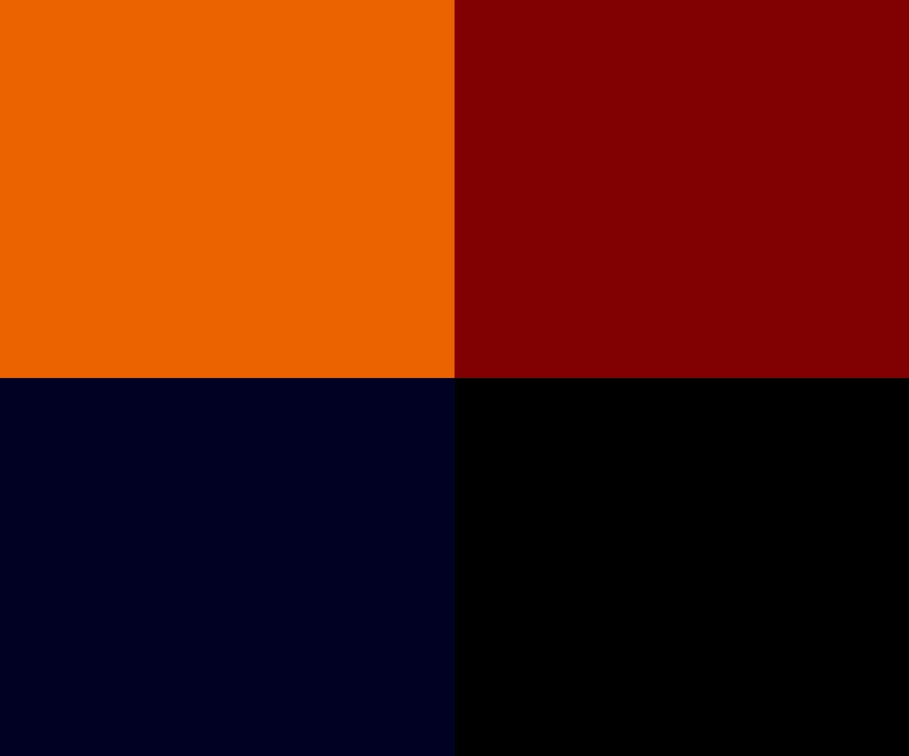
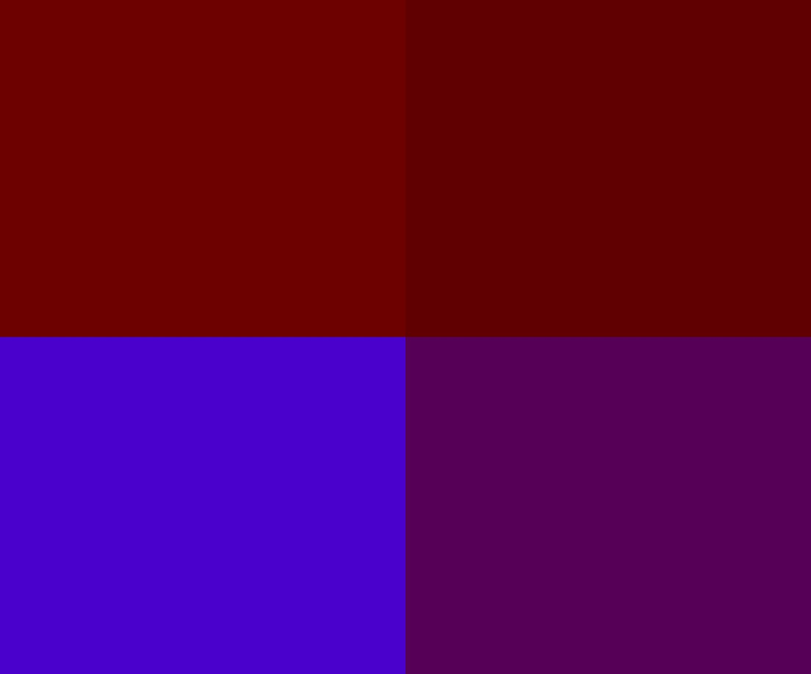

# 16.10.2023

- [16.10.2023](#16102023)
  - [Resources](#resources)
  - [Excercise 1](#excercise-1)
    - [Solution](#solution)
  - [Excercise 2](#excercise-2)
    - [Notes](#notes)
    - [Solution](#solution-1)
  - [Excercise 3](#excercise-3)
    - [Solution](#solution-2)
      - [Saved images](#saved-images)

## Resources


## Excercise 1

Divide the canvas virtually into 2 fields, (left/right). When the mouse is on the left, the background color should change. If you move to the right, into another. As a reminder, mouseX outputs the current mouse position.

When you have achieved this, take one of your previous sketches and extend it with at least 2 if statements!

### Solution

[p5js editor - if excercise 1](https://editor.p5js.org/stefanvoegelisrf/sketches/XOCQzLZX2)

## Excercise 2

Try to divide the sketch window into four areas: top left, top right, bottom left and bottom right. As soon as the mouse moves into one of the areas, the background color should change accordingly. Think about your requirements on paper first, writing down the conditions that must be met for the sketch to work. Only when you have solved the conditions on paper, start coding. Remember to combine two (or more) conditions with the && sign. Bonus: try adding a fade function. When the mouse is over a quadrant, the color fades in. When the mouse leaves the area, it fades out again.

### Notes

To divide the window into four areas, I need to define the boundaries of the four areas.
To find out, over which boundary the mouse is, I can use the ```mouseMoved``` function.
In this function, I can check for each of the four boxes, if the mouseX and the mouseY are inside the boundary.
When the mouse is inside a box, I set the color of the corresponding box.
To add a fade effect, I remove 1 from the rgb values of each box each time, ```draw``` is called.

### Solution

[p5js editor - if excercise 2](https://editor.p5js.org/stefanvoegelisrf/sketches/ZaTcr0Qkl)

## Excercise 3

### Solution

[p5js editor - if excercise 3](https://editor.p5js.org/stefanvoegelisrf/sketches/ZaTcr0Qkl)

#### Saved images


