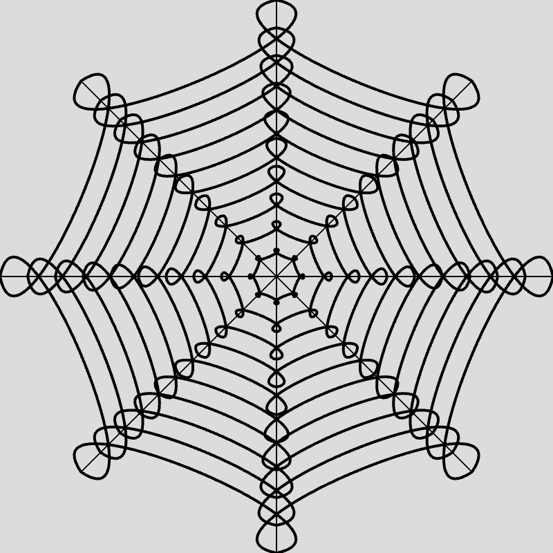

# 30.10.2023

- [30.10.2023](#30102023)
  - [Resources](#resources)
  - [Spiderweb excercise](#spiderweb-excercise)
    - [Prompt](#prompt)
    - [Generated code](#generated-code)
    - [Generated image](#generated-image)
  - [Postcard excercise](#postcard-excercise)
    - [Ideation](#ideation)
      - [Face parts](#face-parts)
        - [Eyes](#eyes)
          - [Iris and pupil points](#iris-and-pupil-points)
        - [Nose](#nose)
        - [Mouth](#mouth)

## Resources

- [P5.js SVG](https://github.com/zenozeng/p5.js-svg)

## Spiderweb excercise

### Prompt

Please create a p5js script to create a spiderweb.
The spiderweb consists of 8 sections, which are all done in the same way, but displayed with rotation of 45 degrees. The first section ranges from 0 to 45 degrees, the second from 45 to 90 degrees and so on.
For each section, a line(name:startline) is drawn from the center of the sketch, to the top of the sketch. This marks the start of the section. To mark the end of the section, a line(name:endline) is drawn but rotated 45 degrees based on the start of the line.
To create the web, there is an arc drawn with the first point being on the startline and the second point being on the endline. Each arc has a distance of 20 to the next arc. The arc needs to be upside down.

### Generated code

```javascript
let sections = 8;
let distanceBetweenArcs = 20;

function setup() {
  createCanvas(400, 400);
  angleMode(DEGREES);
}

function draw() {
  background(220);

  translate(width / 2, height / 2);

  for (let i = 0; i < sections; i++) {
    push();
    rotate(i * 45);
    drawSpiderwebSection();
    pop();
  }
}

function drawSpiderwebSection() {
  let radius = height / 2;
  let startLineEnd = createVector(0, -radius);
  let endLineEnd = createVector(0, -radius).rotate(45);

  // Draw start line
  line(0, 0, startLineEnd.x, startLineEnd.y);

  // Draw end line
  line(0, 0, endLineEnd.x, endLineEnd.y);

  // Draw arcs
  for (let i = 1; i <= radius / distanceBetweenArcs; i++) {
    let currentRadius = i * distanceBetweenArcs;
    let angle = 45;
    let arcStart = startLineEnd.copy().setMag(currentRadius);
    let arcEnd = endLineEnd.copy().setMag(currentRadius);

    // Calculate control points for the bezier curve to create an upside down arc
    let controlPoint1 = arcStart.copy().rotate(-angle / 2);
    let controlPoint2 = arcEnd.copy().rotate(angle / 2);

    // Draw the arc using bezier curve
    noFill();
    stroke(0);
    strokeWeight(2);
    beginShape();
    vertex(arcStart.x, arcStart.y);
    bezierVertex(
      controlPoint1.x,
      controlPoint1.y,
      controlPoint2.x,
      controlPoint2.y,
      arcEnd.x,
      arcEnd.y
    );
    endShape();
  }
}

```

### Generated image




## Postcard excercise

We are slowly approaching the middle of the semester and it is a good moment to look back at what we have already done. With translate(), rotate() and scale() we have learned important new functions with which we can quickly create patterns and generative shapes. Have a look at the wiki pages in the exorciser of the last weeks. Especially have a look at the loops with for/while.

The idea with the generative postcard is that you capture the output of one of your sketches in postcard format. It's not primarily about creating a highly complex mathematical pattern, but about showing off your design skills. Take notes on paper and ask yourself what aesthetics you want to use. What do you want to express? Does the format or history of the postcard matter? Time, transportation? Is there an overriding theme to your design? A word that fits? Is it a series?

By choosing the cut-out, color and possibly typography, you determine important design parameters.

### Ideation

I want to create random faces drawn with ellipses. The faces consist of 2 eyes, nose, mouth.
The vertices for the parts of the face are a set of fixed values.

TODO: add more ideation

#### Face parts

##### Eyes

The eyes consist of three parts: Sclera, iris, pupil. There are more parts to eyes(brows, lashes, ...) but we'll keep it simple for now.


To start simple, the iris and the pupil are **ellipses**. To calculate the points of the ellipses, **sin** and **cosin** can be used.
The sclera is not an ellipse but we can also calculate the points using **sin** and **cosin**. It can be made of two arcs.

###### Iris and pupil points

To calculate the points of an ellipse for the iris and the pupil, I can use the following code:

```javascript
let amountOfPoints = 200;
let ellipseRadius = 100;
let diameter = ellipseRadius * 2;

function setup() {
  createCanvas(windowWidth, windowHeight);
  background(220);
  angleMode(DEGREES);
  strokeWeight(2);
  noLoop();
}

function draw() {
  translate(windowWidth * 0.5, windowHeight * 0.5);

  let circumference = diameter * PI;
  let circumferenceLengthPerPoint = circumference / amountOfPoints;

  for (let i = 0; i < amountOfPoints; i++) {
    let currentArc = circumferenceLengthPerPoint * (i + 1);
    let currentAngle = map(currentArc, 0, circumference, 0, 360);
    point(sin(currentAngle) * ellipseRadius, cos(currentAngle) * ellipseRadius);
  }
}
```

##### Nose


##### Mouth

