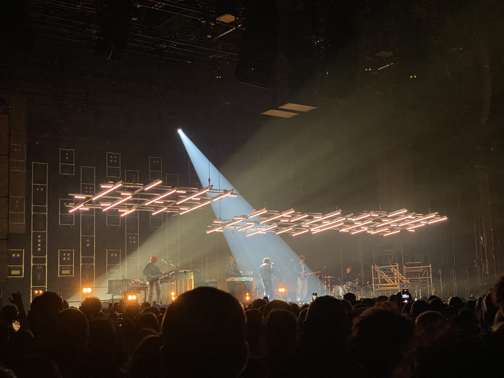

# End project

- [End project](#end-project)
  - [Resources](#resources)
  - [Requirements](#requirements)
    - [Presentation](#presentation)
    - [Documentation](#documentation)
  - [Variant 1 - Clock](#variant-1---clock)
    - [Inspiration](#inspiration)
  - [Variant 2 - Taking data for a walk](#variant-2---taking-data-for-a-walk)
    - [Resources](#resources-1)
      - [APIs](#apis)
    - [BehiG](#behig)
    - [Lomepal stage design inspired clock](#lomepal-stage-design-inspired-clock)
      - [Inspired by](#inspired-by)


## Resources

- [Briefing end project](Briefing%20Kickstart%20Prog%202023.pdf)
- [Moodboard](https://miro.com/app/board/uXjVNP36mxQ=/?share_link_id=933066774215)

## Requirements

Create a project for one of the two variants.

### Presentation

Create a short presentation showing off the project idea.

- Concept
- Moodboard
- Inspiration
- First prototypes

Date: 18.12.2023
Duration: 5 min presentation + 5 min discussion

### Documentation

The project is best uploaded to Ilias as a zip file with the following folder structure:

```
Project/
- Project files, code, etc.
- The project should be executable without special knowledge.

Documentation/
- Short documentation (.pdf) (see project documentation output for study program
(must)) -> https://exorciser.ch/_media/di/three/stuemtec/
di_projektdokumentation_v05_interaktiv.pdf
- Presentation (.pdf) (submission after presentation)

Pictures/
- Screenshots, etc. (.jpg, .png, etc) (resolution see project documentation)

Videos/
Videos (.mp4) (codec see project documentation)
```

Additional info images: 2-3 screenshots, video screencast max. 60-90 sec.
The submission must be properly structured and labeled.

- Create a short video clip or an animated gif that shows the clock or the data project in action (e.g. special events at full hour or other special features that you would not be able to see immediately if you only opened the sketch at a convenient time) and also save the clip in Ilias (mp4, dimensions: 1920x1080px)

## Variant 1 - Clock

Try to develop a new graphical concept for the representation of time. In doing so, you should question our common interpretation of "how we represent time". You are completely free to work with graphic elements, such as colors shapes or transparency.
Video, sound, typography, stories, 3D, everything is allowed. There are no restrictions. Nevertheless, in most cases you will use the function hour(), minute(), second(). You can also use millis(), day() and month() if you wish (but this is not a requirement)

### Inspiration

- [Wikipedia - History of timekeeping devices](https://en.wikipedia.org/wiki/History_of_timekeeping_devices)
- [Cabinet Magazine - A MINOR HISTORY OF TIME WITHOUT CLOCKS](https://www.cabinetmagazine.org/issues/29/foer.php)
- [YouTube - SpotImageryLtd - TimeLine - A Brief Introduction To The History Of Timekeeping Devices](https://www.youtube.com/watch?v=At5atF4mKiU)
- [Golancourses - Visualizing time](https://golancourses.net/2015/lectures/visualizing-time/)
- [GitHub - John Maeda - 12 o'clocks](https://codingtrain.github.io/12oclocks/)
- [Angesleva - Jussi Ängeslevä with Ross Cooper - Last Clock](http://angesleva.iki.fi/art/last/)
- [Instagram - Humans Since 1982](https://www.instagram.com/humanssince1982/)
- [Instagram - Humism](https://www.instagram.com/humism/)
- [Vendian - Mitchell N Charity - Dot Clock](http://www.vendian.org/envelope/dir2/day_of_dots/)

## Variant 2 - Taking data for a walk

Data is everywhere. It influences the way we read and write the world. Weather forecasts determine whether we plan a trip at the weekend or not. How can we interact with complex data in a playful way? Is it the task of the designer to make data more comprehensible or to create ambiguity? A data set is the starting point for you to deal with questions of narrative and the translation of data. Through the usage of an accessible web API or existing data, you develop a project that visualizes a specific aspect of a data set.
Applicable APIs: Weather, climate, Twitter, airplanes, ...

### Resources

- [GitHub - Max Frischknecht - Visualizign cultural heritage](https://github.com/baselcodes/BCD2023/tree/main/visualizing-cultural-heritage)
- [Critical Media Lab](https://criticalmedialab.ch/)
- [UNIBAS - Participatory Knowledge Practices in Analogue and Digital Image Archives](https://dbis.dmi.unibas.ch/research/projects/pia/)

#### APIs

- [Opendata](https://opendata.swiss/de)
- [SRGSSR APIs](https://developer.srgssr.ch/api-catalog)
- [GitHub - Public APIs](https://github.com/public-apis/public-apis)
- [data.gov.tw - Taiwan public APIs](https://data.gov.tw/)
  - [Public APIs - Open government APIs Taiwan](https://publicapis.io/open-government-taiwan-api)
- [data.gouv.fr - France public APIs](https://www.data.gouv.fr/fr/)
  - [Public APIs - Open government APIs France](https://publicapis.io/open-government-france-api)
- [Participatory Archive](https://participatory-archives.ch/s/explore)
- [US Open data](https://data.gov/)
- [Wikidata - REST API](https://www.wikidata.org/wiki/Wikidata:REST_API)
- [Geo admin APIs](https://api.geo.admin.ch/)
  - [Documentation](https://www.geo.admin.ch/de/programmierschnittstelle-api)
- [Opendata Canton ZH](https://www.zh.ch/de/politik-staat/opendata.html)
  - [GitHub - Canton ZH Covid 19](https://github.com/openZH/covid_19)
- [Google Developer](https://developers.google.com/maps?hl=de)
- [N2YO - Satellite API](https://www.n2yo.com/api/)
- [opentransportdata.swiss - Strassenverkehr](https://opentransportdata.swiss/de/strassenverkehr/)
- [opentransportdata.swiss - Bestandsaufnahme BehiG](https://opentransportdata.swiss/de/dataset/prm_data)
  - [övinfo.ch - Barrierefreier Zugang](https://www.xn--v-info-vxa.ch/de/datenmanagement/barrierefreier-zugang/erfassung)
  - [opentransportdata.swiss - Verkehrspunktelemente](https://opentransportdata.swiss/de/dataset/didok/resource/28ef7f3d-e793-49c7-a5fe-d22ff63e952b)
  - [opentransportdata.swiss - Verkehrspunktelemente API URL](https://opentransportdata.swiss/de/api/1/util/snippet/api_info.html?resource_id=28ef7f3d-e793-49c7-a5fe-d22ff63e952b)
  - [opentransportdata.swiss - Zugänglichkeit von Haltekanten](https://opentransportdata.swiss/de/dataset/prm_data/resource/5940d7e5-7456-4f02-bb24-f25506036b48)
  - [opentransportdata.swiss - Zugänglichkeit von Haltekanten API URL](https://opentransportdata.swiss/de/api/1/util/snippet/api_info.html?resource_id=5940d7e5-7456-4f02-bb24-f25506036b48)
- [opentransportdata.swiss - API cookbook](https://opentransportdata.swiss/de/cookbook/)
  - [opentransportdata.swiss - API usage](https://opentransportdata.swiss/de/cookbook/verwendung-der-api/)

### BehiG

> See: [Sketch](data%20vis%20behig/dist/)

#### Developer Setup

- Create account on [opentransportdata.swiss - Registration](https://opentransportdata.swiss/de/register)
- Create API key on [opentransportdata.swiss - Dev Dashboard](https://opentransportdata.swiss/de/dev-dashboard/)
- Set API key using `Authorization` header


### Lomepal stage design inspired clock

> See: [Sketch](clock-lomepal-stage-design/dist)

#### Inspired by



I went to a concert of the french artist Lomepal. The stage design was very flexible and allowed different layouts which were changed throughout the concert.
I did not memorize the whole stage layout, but some parts of the lighting inspired me to create a watch.
There were 3 hanging lighting construction with lights of individual lengths. They were moveable and were used in different rotations and heights.
Attached to the construction were elongated lights in different lengths as visible above.
As there were three constructions, this led me to recreate these lights and use them to display time.